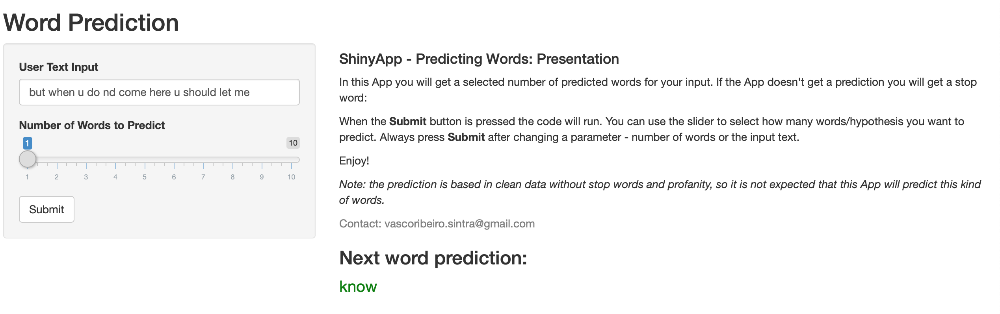

```{r setup, include=FALSE}
knitr::opts_chunk$set(echo = FALSE)
```

## Scope

The algorithm produced and running on [ShinyApps](https://vascoribeiropereira.shinyapps.io/PredictingWords/) website is capable of generate predictions of the next word in a sentence taking into account up to five non-stop and non-profane word inputs.

The user writes in the text field and the code clean the inputed text and search the best match in the markovchain database, created from a mix of twitter posts and news publications in english. The original datasets can be found [Here](https://d396qusza40orc.cloudfront.net/dsscapstone/dataset/Coursera-SwiftKey.zip).

## The algorithm

The prediction algorithm is based on a [Markov chain](https://en.wikipedia.org/wiki/Markov_chain) model where the probability of the next word is calculated based on the last word.

In the presented case we have 5 Markov chains, from a single word up to a sequence of five words, in order to improve the prediction strength of the algorithm. This means that the probability of the 5th word is determined based on the first 4 words. If it isn't found any instance in a 5-gram Marvov chain model it compares three last imputed words to find the fourth, and so on until it reaches the 1-gram Markov chain model.

If the inputed word doesn't exist in the model the algorithm will suggest a random stop word.

## How to use the App

Go to the website with a running demo of the app at [ShinyApps](https://vascoribeiropereira.shinyapps.io/PredictingWords/). 
There you will find a text box to input the text missing the last word to predict, a slider if you want more than 1 suggestion and a submit button to run the prediction.

The image bellow is an example of the App working:

{width=90%}


## Right at first time analysis

The Markov chain models were generated based on a random sample of entries from the datasets:   
- 50 ppm of the news data   
- 300 ppm of the twitter data   

This models have a total size of 1Mb, and since they are small they lack the "right at first time" characteristic: it predicted the last word correctly **5%** of the times.

This is something common in this kind of algorithms because they are intended to learn from user input, so this algorithm would be a good starting point to a new user and is expected to improve this percentage exponentially as the user uses our app.

## End Notes

*From here on this message is for my Peers*

My complete code can be found on my [GH Page](https://github.com/VascoRibeiroPereira/dsCapstoneNew).

Since I'm not a programmer (R was my first experience), I may be laking skills to complete this task at 100%, and this is quite frustrating. In fact, I would never expect someone to find my app a "novel approach" or to "hire me" as a data scientist based on this work.

I would kindly ask that, if your evaluation is not enough for me to pass, to give me help to improve my code; my email is vascoribeiro.sintra@gmail.com.


Thank you for your time,   
Vasco
